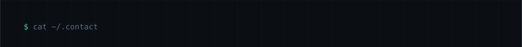
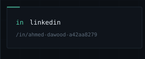
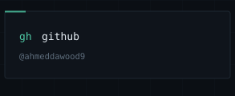
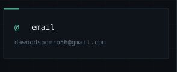
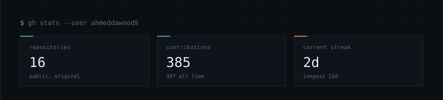
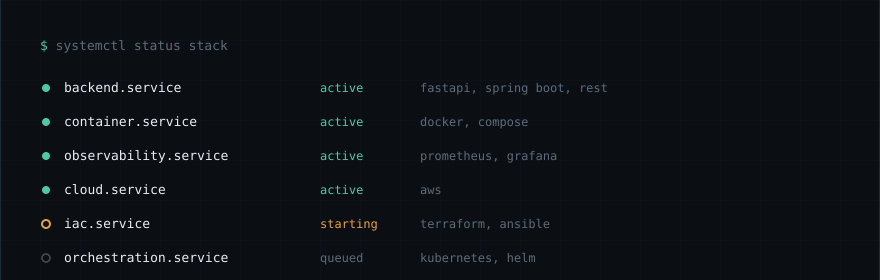
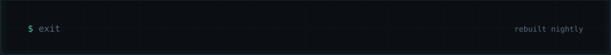

<!-- Keep ALL slice images on ONE line with no whitespace between tags.
     A newline renders as a space, and a blank line starts a new paragraph
     with its own margin. Either one opens a visible seam in the console. -->

